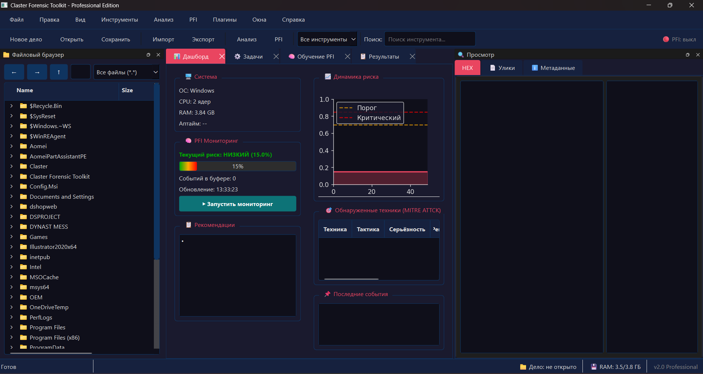
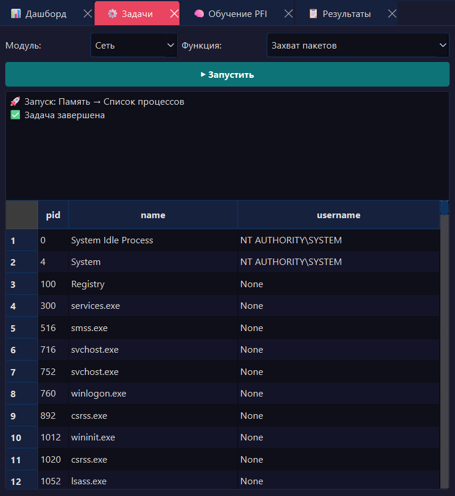
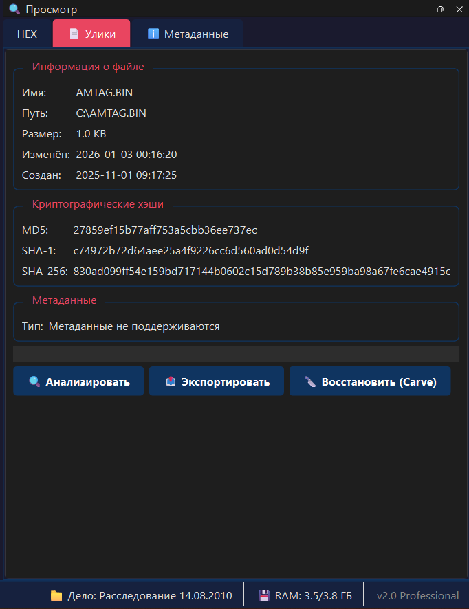
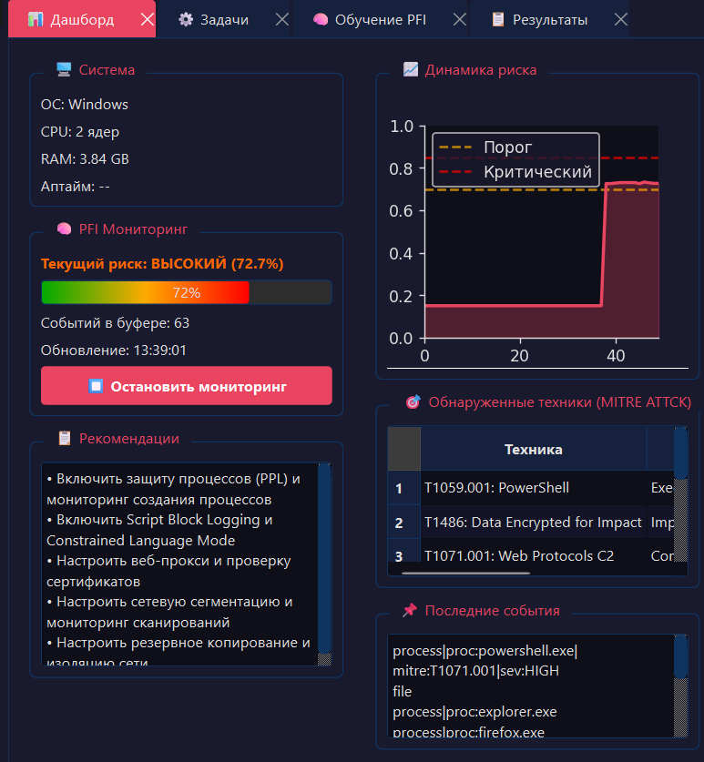
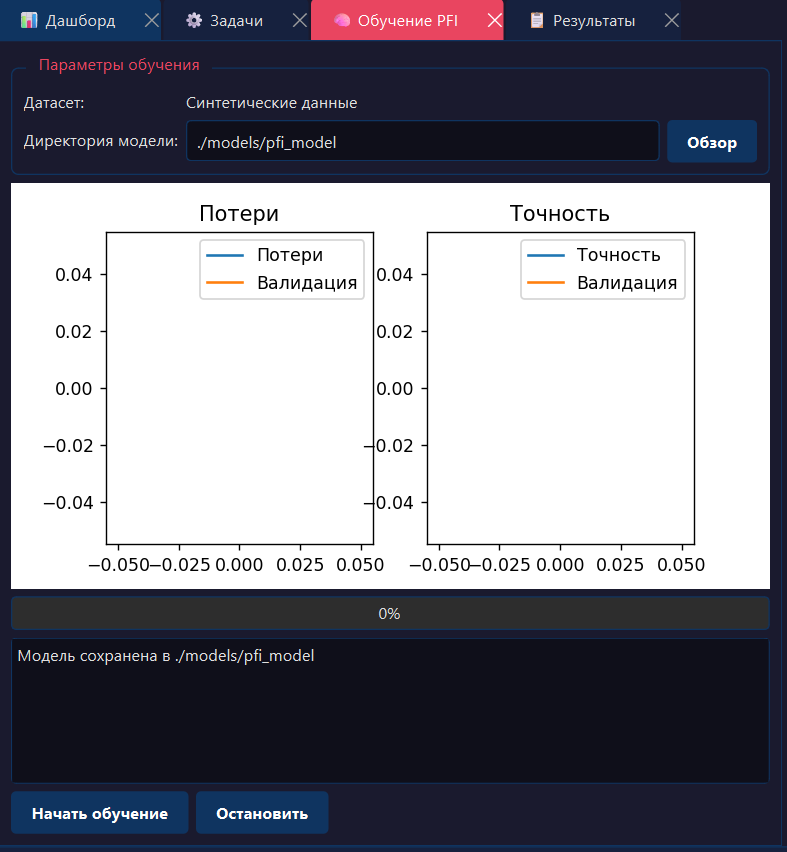

# 🔍 Claster Forensic Toolkit

<div align="center">


**Профессиональный инструмент компьютерной криминалистики с открытым исходным кодом**

*Создано в рамках школьного индивидуального проекта • 2026*

[](https://opensource.org/licenses/MIT)
[](https://www.python.org/downloads/)
[]()

---

### 📱 QR-код проекта


*Отсканируйте, чтобы открыть репозиторий*

---

</div>

---

## 📸 Скриншоты

### Главное окно программы



*Полнофункциональный интерфейс: файловый браузер слева, HEX-просмотрщик и свойства справа, дашборд PFI по центру, терминал и управление делом внизу.*

---

### Инструменты форензики — выполнение задач



*Более 270 функций компьютерной криминалистики доступны через меню Инструменты. Запуск любой функции с автоматическим диалогом параметров. Результаты отображаются в виде структурированных таблиц.*

---

### HEX-просмотрщик и метаданные



*Просмотр файлов в шестнадцатеричном формате. Автоматическое извлечение метаданных, вычисление криптографических хэшей (MD5, SHA-1, SHA-256), предпросмотр изображений.*

---

### Дашборд PFI — нормальный режим


*Система в нормальном состоянии. Риск атаки минимален (15%). Доступен запуск мониторинга PFI.*

---

### Дашборд PFI — обнаружена угроза (72.7%)



*Мониторинг в реальном времени обнаружил подозрительную активность. Отображаются:*
- *График динамики риска*
- *Обнаруженные техники MITRE ATT&CK (T1059.001 PowerShell, T1486 Ransomware, T1071.001 C2)*
- *Рекомендации по устранению угроз*

---

### Обучение нейросети PFI



*Обучение модели Transformer+CNN на синтетических данных. Отображаются графики функции потерь и точности в реальном времени. Модель сохраняется для последующего использования.*

---

## 🚀 Возможности

<details open>
<summary><b>💾 Анализ дисков и файловых систем</b></summary>

- Парсинг MFT (Master File Table) NTFS
- Анализ USN журнала изменений
- Извлечение альтернативных потоков данных (ADS)
- Кара́винг файлов по сигнатурам (JPEG, PNG, PDF, ZIP, RAR, Office и др.)
- Анализ slack-пространства и неразмеченных областей
- Поддержка FAT32, exFAT, Ext4
- Создание и монтирование образов (dd, E01)
- Обнаружение timestomping и аномалий MFT
</details>

<details>
<summary><b>🧮 Анализ оперативной памяти</b></summary>

- Дамп процессов и всей системы
- Список процессов с полной информацией
- Извлечение строк, паролей, скриншотов из дампа
- Обнаружение скрытых процессов и внедрения кода
- Анализ конфигурации вредоносного ПО
- Извлечение сетевых соединений из дампа
</details>

<details>
<summary><b>🌐 Сетевой анализ</b></summary>

- Захват и анализ пакетов (PCAP)
- Извлечение файлов HTTP, FTP, SMB
- Восстановление TCP-потоков
- Извлечение SSL/TLS сертификатов
- Анализ DNS (включая обнаружение туннелирования)
- Сканирование портов (TCP/UDP)
- ARP-сканирование и построение карты сети
- GeoIP и WHOIS
- Обнаружение атак (сканирование портов, DDoS)
</details>

<details>
<summary><b>📝 Анализ реестра Windows</b></summary>

- Парсинг офлайн-кустов реестра
- Автозагрузка (Run, RunOnce, Shell, Userinit)
- История USB-устройств
- UserAssist, RecentDocs, MRU-списки
- Сетевые интерфейсы и Wi-Fi профили
- Установленное ПО и история удаления
- Извлечение хэшей SAM и секретов LSA
- Запланированные задачи, службы, драйверы
</details>

<details>
<summary><b>🌍 Анализ браузеров</b></summary>

- Chrome/Chromium/Edge: история, пароли, загрузки
- Firefox: история, пароли
- Skype, Telegram, Discord, WhatsApp
- Парсинг Thumbs.db
- Recent Files
</details>

<details>
<summary><b>🔐 Криптография</b></summary>

- Хэширование (MD5, SHA1, SHA256, SHA512, SHA3, BLAKE2)
- AES шифрование/дешифрование (CBC, ECB, GCM)
- RSA шифрование/дешифрование и генерация ключей
- Взлом ZIP, PDF, RAR, 7z (словарный и брутфорс)
- Расчёт энтропии Шеннона
- Обнаружение и расшифровка BitLocker
</details>

<details>
<summary><b>🖼️ Стеганография</b></summary>

- LSB встраивание/извлечение текста и файлов
- DCT стеганография в JPEG
- Эхо-стеганография в аудио
- Стеганография в движении видео
- Обнаружение (хи-квадрат, RS-анализ, визуальный анализ)
</details>

<details>
<summary><b>📊 Метаданные</b></summary>

- EXIF и GPS координаты из изображений
- Метаданные Office (DOCX, XLSX, PPTX)
- Метаданные PDF
- ID3 теги аудио
- Метаданные видео
- Метаданные архивов (ZIP, RAR, 7z)
- Метаданные ярлыков .lnk
- Метаданные файловой системы
</details>

<details open>
<summary><b>🧪 Предиктивная форензика (PFI)</b></summary>

- **Transformer + CNN модель** для анализа последовательностей событий
- Обнаружение аномалий в реальном времени
- Мониторинг рисков с визуализацией (график динамики)
- Классификация техник MITRE ATT&CK
- Генерация рекомендаций по устранению угроз
- Обучение на синтетических и реальных данных
</details>

<details>
<summary><b>📄 Генерация отчётов</b></summary>

- HTML отчёты с современным дизайном
- PDF отчёты (ReportLab)
- DOCX отчёты (python-docx)
- CSV и JSON экспорт
- Цепочка хранения доказательств (Chain of Custody)
- Цифровая подпись отчётов (RSA)
</details>

---

## 💻 Установка

### Системные требования

| Компонент | Минимум | Рекомендуется |
|-----------|---------|---------------|
| **ОС** | Windows 10/11 (x64), Linux (x64), macOS 12+ | Windows 11 |
| **Python** | 3.11 | 3.12+ |
| **RAM** | 8 ГБ | 16 ГБ |
| **Место на диске** | 2 ГБ | 10 ГБ |
| **Видеокарта** | Не требуется | NVIDIA GPU (для TF) |

### Установка из исходного кода

```bash
# 1. Клонируйте репозиторий
git clone https://github.com/qjfrwkh48x-alt/ClasterForensicToolkit.git
cd ClasterForensicToolkit

# 2. Создайте виртуальное окружение
python -m venv venv

# 3. Активируйте виртуальное окружение
# Windows:
venv\Scripts\activate
# Linux/macOS:
source venv/bin/activate

# 4. Установите все зависимости одной командой
pip install -r requirements.txt
Содержимое requirements.txt
text
PyQt6>=6.5.0
PyQt6-Qt6>=6.5.0
PyQt6-sip>=13.5.0
matplotlib>=3.7.0
tensorflow>=2.12.0
numpy>=1.24.0
pandas>=2.0.0
scikit-learn>=1.3.0
scipy>=1.10.0
h5py>=3.8.0
tqdm>=4.65.0
scapy>=2.5.0
psutil>=5.9.0
Pillow>=9.5.0
pycryptodome>=3.19.0
cryptography>=41.0.0
python-docx>=0.8.11
openpyxl>=3.1.0
python-pptx>=0.6.21
PyPDF2>=3.0.0
mutagen>=1.46.0
Jinja2>=3.1.0
reportlab>=4.0.0
PyYAML>=6.0
loguru>=0.7.0
🎯 Быстрый старт
Запуск графического интерфейса
bash
python main.py
Запуск консольной версии
bash
python -m claster cli hash файл.txt --algo sha256
Обучение модели PFI
bash
python -m claster.pfi.train --dataset synthetic --epochs 20 --output models/pfi_model
Пример использования API
python
from claster.disk.mft import parse_mft
from claster.network.capture import sniff_packets
from claster.pfi.inference import load_model, predict_attack_probability

# Парсинг MFT
records = parse_mft("\\\\.\\C:")

# Захват пакетов
packets = sniff_packets(count=100, output_pcap="capture.pcap")

# Загрузка модели PFI и предсказание
model = load_model("models/pfi_model")
prob, label, details = predict_attack_probability(["process:chrome.exe:start", "network:https:443"])
print(f"Риск: {label} ({prob:.1%})")
🧠 PFI (Predictive Forensic Intelligence)
Как это работает
Модель PFI анализирует последовательности системных событий и предсказывает вероятность атаки. Она обучена на тысячах синтетических примеров нормальной и вредоносной активности.

Архитектура нейросети
text
Вход: последовательность событий (40 токенов)
    ↓
Эмбеддинг (64 измерения)
    ↓
Позиционное кодирование
    ↓
Transformer Block 1 (Multi-Head Attention, 4 головы)
    ↓
Transformer Block 2 (Multi-Head Attention, 4 головы)
    ↓
    ├→ Глобальный Average Pooling (контекст)
    └→ Conv1D + Global Max Pooling (локальные признаки)
    ↓
Объединение признаков (128 измерений)
    ↓
Dense(128) + Dropout(0.2)
    ↓
Выход: benign / attack (вероятности)
Обнаруживаемые техники MITRE ATT&CK
ID техники	Название	Тактика	Серьёзность
T1059.001	PowerShell	Execution	🔴 HIGH
T1055.001	Process Hollowing	Defense Evasion	🔴 HIGH
T1003.001	LSASS Memory Dump	Credential Access	⚫ CRITICAL
T1046	Network Scanning	Discovery	🟡 MEDIUM
T1071.001	Web Protocols C2	Command & Control	🔴 HIGH
T1110.001	Password Guessing	Credential Access	🟡 MEDIUM
T1486	Data Encrypted for Impact	Impact	⚫ CRITICAL
T1566.001	Spearphishing Attachment	Initial Access	🔴 HIGH
T1547.001	Registry Run Keys	Persistence	🟡 MEDIUM
T1048.003	DNS Exfiltration	Exfiltration	🔴 HIGH
📦 Сборка в EXE-файл
Быстрая сборка (в папку — мгновенный запуск)
bash
pyinstaller --onedir --windowed --name="ClasterForensicToolkit" --icon="icon.ico" --add-data="claster;claster" --add-data="config.yaml;." --add-data="requirements.txt;." --hidden-import=tensorflow --hidden-import=PyQt6 --collect-all=tensorflow --collect-all=PyQt6 --collect-all=matplotlib main.py
Готовая программа: dist/ClasterForensicToolkit/ClasterForensicToolkit.exe

Сборка в один файл (медленный запуск, но удобно для распространения)
bash
pyinstaller --onefile --windowed --name="ClasterForensicToolkit" --icon="icon.ico" --add-data="claster;claster" --add-data="config.yaml;." --hidden-import=tensorflow --hidden-import=PyQt6 --collect-all=tensorflow --collect-all=PyQt6 --collect-all=matplotlib main.py
🏗️ Структура проекта
text
ClasterForensicToolkit/
│
├── main.py                         # Точка входа в программу
├── icon.ico                        # Иконка приложения
├── config.yaml                     # Файл конфигурации
├── requirements.txt                # Зависимости Python
├── LICENSE                         # Лицензия MIT
├── README.md                       # Этот файл
│
├── screenshots/                    # Скриншоты интерфейса
│   ├── main_window.png
│   ├── instruments.png
│   ├── Hex.png
│   ├── monitoring.png
│   └── pfi_train.png
│
├── claster/                        # Основной модуль
│   ├── core/                       # Ядро системы
│   │   ├── config.py               # Конфигурация
│   │   ├── database.py             # База данных дел
│   │   ├── events.py               # Система событий
│   │   ├── hashing.py              # Хэширование
│   │   ├── logger.py               # Логирование
│   │   └── utils.py                # Утилиты
│   │
│   ├── disk/                       # Дисковая форензика
│   │   ├── mft.py                  # MFT парсер
│   │   ├── usn.py                  # USN журнал
│   │   ├── carving.py              # Кара́винг файлов
│   │   └── imaging.py              # Образы дисков
│   │
│   ├── registry/                   # Реестр Windows
│   ├── memory/                     # Анализ памяти
│   ├── network/                    # Сетевой анализ
│   ├── stego/                      # Стеганография
│   ├── crypto/                     # Криптография
│   ├── metadata/                   # Метаданные
│   ├── browser/                    # Браузеры
│   ├── pfi/                        # Предиктивная форензика
│   │   ├── model.py                # Transformer модель
│   │   ├── synthetic.py            # Генератор данных
│   │   ├── train.py                # Обучение
│   │   ├── inference.py            # Предсказания
│   │   └── monitor.py              # Мониторинг
│   ├── report/                     # Генерация отчётов
│   └── cli/                        # CLI интерфейс
│
└── gui/                            # Графический интерфейс
    ├── main_window.py              # Главное окно
    ├── styles.qss                  # Стили оформления
    ├── widgets/                    # Виджеты
    │   ├── dashboard.py            # Дашборд PFI
    │   ├── file_browser.py         # Файловый браузер
    │   ├── hex_viewer.py           # HEX-просмотрщик
    │   ├── terminal.py             # Терминал
    │   ├── task_runner.py          # Запуск инструментов
    │   ├── pfi_trainer.py          # Обучение PFI
    │   ├── case_manager.py         # Управление делом
    │   └── evidence_viewer.py      # Просмотр улик
    └── dialogs/                    # Диалоговые окна
        ├── settings.py             # Настройки
        ├── about.py                # О программе
        └── function_args_dialog.py # Параметры функций
```
## 📄 Лицензия
MIT License © 2025 Claster Security

Полный текст: LICENSE

## 🙏 Благодарности

Проект использует следующие open-source библиотеки:

Библиотека	Назначение

TensorFlow	Машинное обучение (PFI)

PyQt6	Графический интерфейс

Scapy	Захват и анализ сетевых пакетов

Matplotlib	Визуализация графиков

scikit-learn	Предобработка данных

Pillow	Обработка изображений

PyCryptodome	Криптография

Jinja2	Шаблоны отчётов

ReportLab	PDF отчёты

python-docx	DOCX отчёты

psutil	Мониторинг процессов

## Также отдельная благодарность выражается:

### Балюра Светлана Анатольевна - главный куратор проекта

### Шкальнюк Юлия Михайловна - предметный куратор
<div align="center">
Создано с ❤️ в рамках школьного индивидуального проекта. Автор - Шмарин Дмитрий

⬆ Наверх

</div> 
